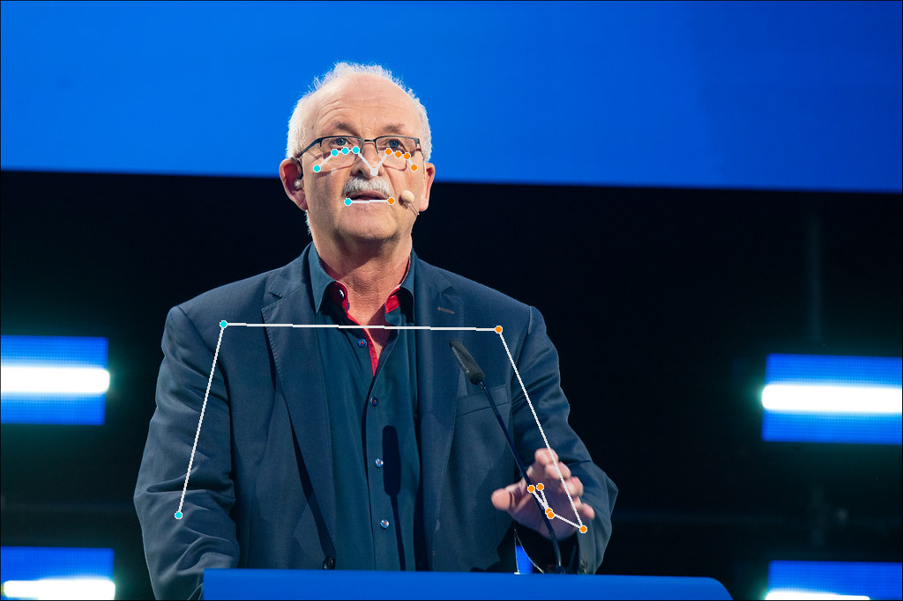

# MediaPipe on AWS Lambda

Sample app to run pose estimation on AWS Lambda using Google's MediaPipe lib, see https://developers.google.com/mediapipe

Returns a presigned URL to the image on S3 with the pose estimation drawn on it.

```sh
# Download the .task file
wget -O pose_landmarker.task -q https://storage.googleapis.com/mediapipe-models/pose_landmarker/pose_landmarker_heavy/float16/1/pose_landmarker_heavy.task

# Deploy to AWS
sls deploy

# To invoke, open the URL in the output of the deploy command

# Cold start time approx. 15s then sub 1s for subsequent requests
```

## AWS lambda pthread naming monkey-patch

pthread_shim.c and Makefile from https://github.com/mitchellharper12/lambda-pthread-nameshim

## All images CC



